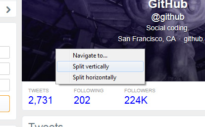

# Viewports #
#### An experimental web browser for large screens. ####

### History ###

As screen sizes and resolutions have increased, we see more website designs making liberal use of the space available. However, the other side to this is that designs are *expected* to make use of the available space, or risk looking dated occupying only 980 pixels in the center of a 4096 pixel screen.

This got me wondering, is there another way that the "screen real estate" could be put to good use? My idea was a web browser which, rather than displaying just one page at a time, displays many. The software developed here is purely an exploration of that concept.

### How it works ###

When the application first starts, there's a familiar URL bar and an empty browsing area. Entering a URL here opens the first browsing window as with any ordinary browser.

[Image: One address bar, one web page](docs/images/il-1.jpg)

Right clicking the web page opens the usual context menu with navigation options, copy and paste commands, etc. However, holding CTRL and right clicking brings up a different context menu.

[Image: Context menu](docs/images/il-2.jpg)

This menu has two noteworthy options:

* Split vertically: Split the browsing area into two columns (left and right).
* Split horizontally: Split the browsing area into two rows (top and bottom).

When a browsing area is split, the original web page is preserved in its current state, but resized to accommodate a new adjacent browsing area. Each area now has its own address bar and navigation buttons, which can be toggled on or off by tapping the CTRL key.

[Image: Two browsing areas](docs/images/il-3.jpg)

There's no hard limit on how many times a browsing area can be split, or whether an area may only be split horizontally or vertically. In the illustration below, after the initial browsing area was split vertically, the second browsing area was split horizontally.

[Image: Three browsing areas](docs/images/il-4.jpg)

### Reflection ###

Having used the software, I was able to appreciate being able to view and interact with multiple web pages without having to switch between tabs or windows. I can imagine the potential for widget-type web pages, such as social and news feeds or chat applications.

There was however a learning curve with regard to controlling each individual browsing area. I'm used to just navigating my mouse to the same URL bar and back button in the same location, rather than having to press a key to open a browsing window's control bar and then specifically target elements on the screen, where ever they may be.

Overall, I'd like to see this functionality added to mainstream browsers in the future, perhaps after some refinement of the UI/UX.

### Development ###

The easiest way to implement a web browser in any Windows project is to use the WebBrowser component offered by the OS. That does mean that in this project the rendering engine is stuck in IE7 mode*, but it does the job well enough for the sake of demonstration.

\* *It's possible to hack it into IE9 mode, but that promised to be more effort than it would have been worth.*

I originally began developing this project in C++. When I had to start writing code like the snippet illustrated below just to convert a string retrieved from a text box into a format that the web browser control could understand, I decided to abandon that idea and switch to C#.

    wchar_t *buffer;
    DWORD size;

    size = MultiByteToWideChar(CP_ACP, 0, webPageName, -1, 0, 0);

    if (!(buffer = (wchar_t *)GlobalAlloc(GMEM_FIXED, sizeof(wchar_t) * size))) goto badalloc;

    MultiByteToWideChar(CP_ACP, 0, webPageName, -1, buffer, size);

    myURL.bstrVal = SysAllocString(buffer);

    GlobalFree(buffer);

The UI and control scheme went through many revisions. It was quite difficult to pin down an intuitive and non-intrusive way of offering the user simultaneous control over many different web pages. I'm sure that with a bit more thought, it could be made even better.

### Feedback ###

Comments are welcome either as issues on the GitHub page or via email at terence.copestake@gmail.com